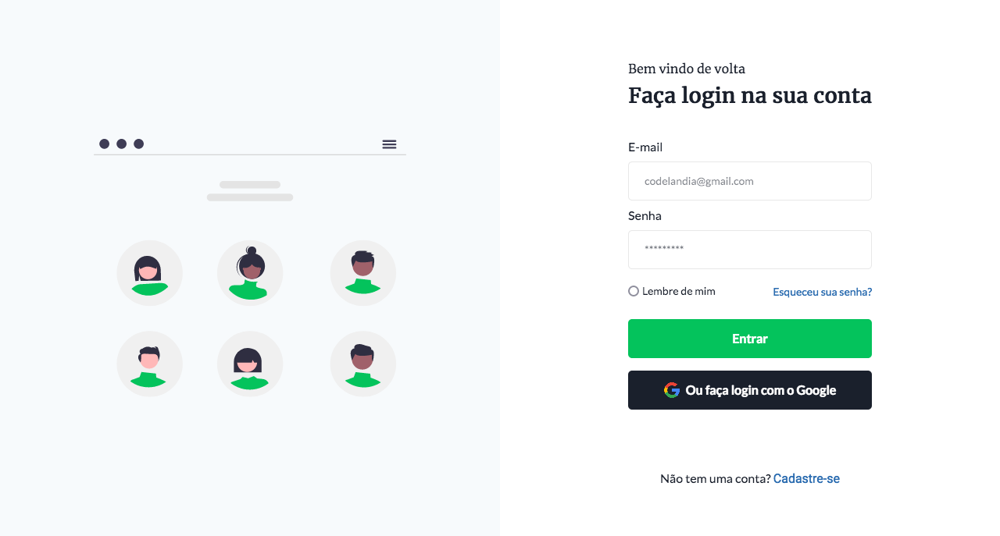

# Login - Codelândia

This is a solution to the [Challenge 4 - Codelândia](<https://www.figma.com/file/dZpFBpJRNK8ATKJfSylYCr/Desafios---Codel%C3%A2ndia-(Copy)?node-id=4261%3A2>). Codelândia challenges help you improve your coding skills by building realistic design.

## Table of contents

- [Overview](#overview)
  - [The challenge](#the-challenge)
  - [Screenshot](#screenshot)
  - [Links](#links)
- [My process](#my-process)
  - [Built with](#built-with)
  - [What I learned](#what-i-learned)
  - [Useful resources](#useful-resources)
- [Author](#author)

## Overview

### The challenge

Users should be able to:

- View the optimal layout for the page depending on their device's screen size

### Screenshot



### Links

- Solution URL: [Github](https://github.com/gugavillar/login)
- Live Site URL: [Login](https://gugavillar.github.io/login/)

## My process

To create this login screen i used HTML5 and CSS3 and follow the figma layout. I had to download some fonts in the google fonts and download some svg images for use in the project

### Built with

- Semantic HTML5 markup
- CSS custom properties
- Flexbox
- Mobile-first workflow

### What I learned

In this project i was learn how to use flex container in css and how to make a screen of login

```css
aside.img,
section.content {
  height: 100vh;
  width: 50%;
  display: flex;
  flex-direction: column;
  align-items: center;
  justify-content: center;
}

div.form-action {
  display: flex;
  flex: 1 0 auto;
  flex-direction: column;
  justify-content: center;
  align-items: center;
}
```

### Useful resources

- [A guide to flexbox](https://css-tricks.com/snippets/css/a-guide-to-flexbox/) - This helped me for understand reason for use flex container in user interface. I really liked this pattern and will use it going forward.

## Author

- Twitter - [@gugacocao](https://twitter.com/gugacocao)
- Linkedin - [gugavillar](https://www.linkedin.com/in/gugavillar/)
